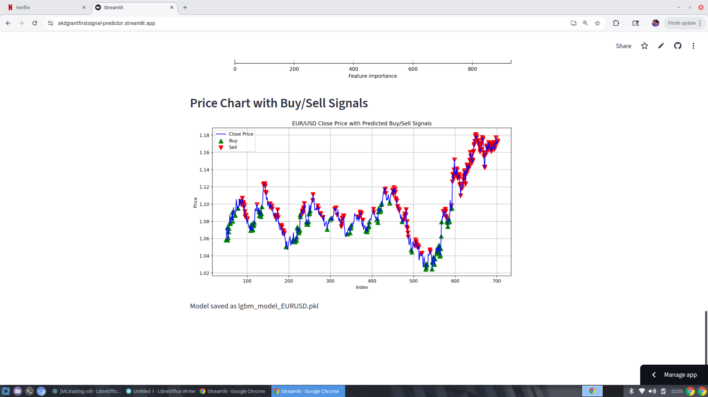
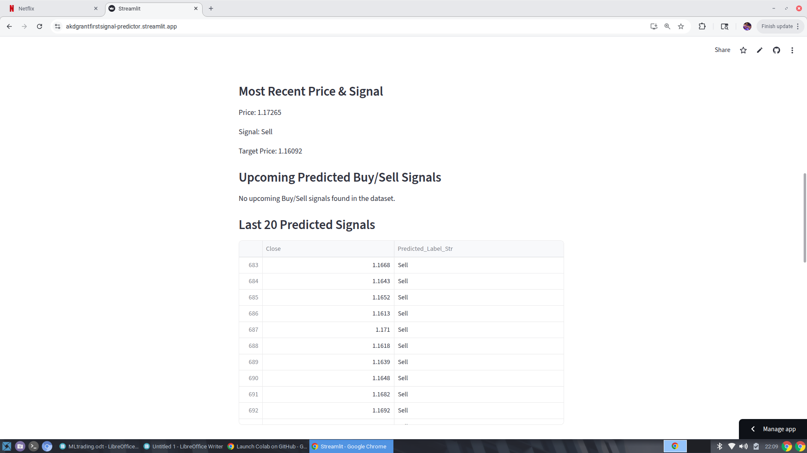

# Multi-Pair Signal Predictor

Predict Buy/Hold/Sell signals for currency pairs using LightGBM and Streamlit.  
This app predicts trading signals based on historical price data, technical indicators, and lagged features, helping traders identify potential market moves.

---

## 📊 Demo Screenshots

### EUR/USD Signal Chart

### Prediction Table Example

---

## 🚀 Live Demo

---

## 🛠 Features

- Predicts **Buy, Hold, Sell** signals for currency pairs.
- Supports **multiple currency pairs** (EUR/USD, GBP/USD, USD/JPY, etc.).
- Computes **technical indicators**: RSI, MACD, ATR, Stochastic K.
- Includes **lagged returns** and optional structural features.
- Shows **most recent signal**, **target prices**, and **upcoming moves**.
- Displays **feature importance**.
- Plots **price charts with Buy/Sell markers**.

---

## 📂 Repository Structure

